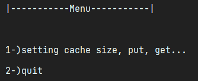

Overlap Program
---
### Goal of the program

    the goal of this program is to accept two lines and tells whether they overlap.

### Program Demonstration

###### Example of two Lines that overlap

* Menu

   

1. Option 1

    

2. Option 2

    

###### Example of two Lines that don't overlap

1. Option 1, Option 2

    
