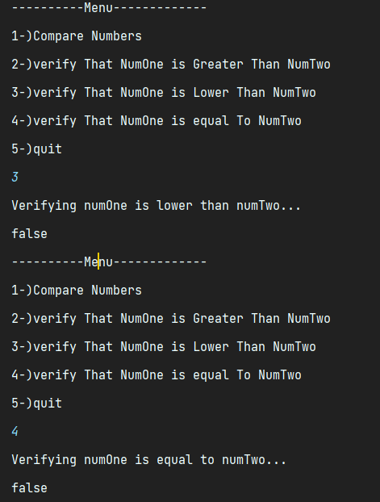

Number Comparator Library
---
### Goal of the program

    the goal of this program is to accept two String numbers and tells 
    whether one is greater, lower or equal to the other.

### Where to find the library on this project
      
      the library is found under out/artifacts/stringComparatorProgram

### How to compile the library in this project
      
      right click on the stringComparatorProgram.jar and click on run
   

### Program Demonstration

###### Example of where number one is greater than number two

    N.B : Know that the values set in the first option are the ones being used
    in the rest of the options (2,3,4)

* Menu

   

1. Option 1

    

2. Option 2

    

3. Option 3, Option 4

    

###### Example of where number one is lower than number two

1. Option 2

   

2. Option 3, Option 4

   

###### Example of where number one is equal than number two

      in this example the output of the option if both the numbers are
      same (1.1 1.1):
      option 1 : will return false
      option 2 : will return also false
      option 3 : will return numOne is indeed equal to numTwo